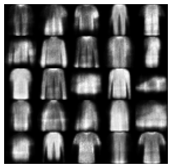
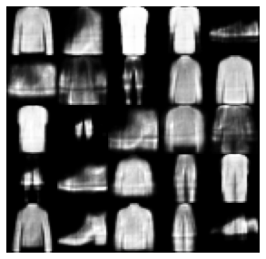
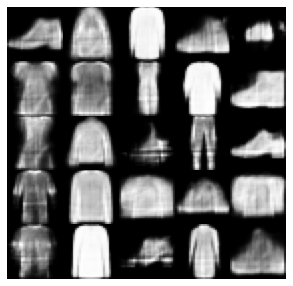
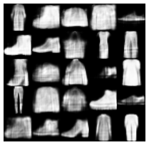
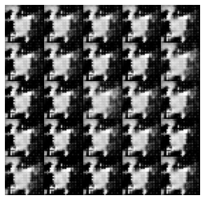
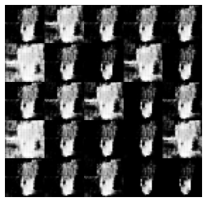
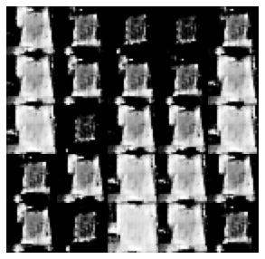
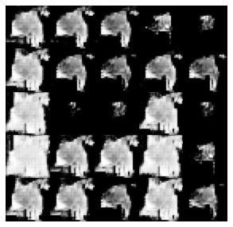

# 基础操作

#### 选择计算设备：tf.device


```python
import tensorflow as tf

with tf.device("/cpu:0"):  # 可改为"/gpu:0",数字表示若有多个同类型设备选择哪一个
    a = tf.random.normal([1, 10])
    b = tf.random.normal([10, 1])
    c = tf.matmul(a, b)
    print(a.device, b.device, c.device)  # 查看张量计算的设备
```

/job:localhost/replica:0/task:0/device:CPU:0    /job:localhost/replica:0/task:0/device:CPU:0                                       

/job:localhost/replica:0/task:0/device:CPU:0


#### 设置GPU显存使用方式


```python
# 设置GPU为增长式占用(按需申请)
def allow_memory_growth():
    gpus = tf.config.experimental.list_physical_devices('GPU')  # 获取GPU设备列表
    if gpus:
        try:
            for gpu in gpus:
                tf.config.experimental.set_memory_growth(gpu, True)
        except RuntimeError as e:
            print(e)
    return
```

#### 关闭警告信息

```python
import os
os.environ['TF_CPP_MIN_LOG_LEVEL'] = "2" # 设置为1屏蔽一般信息，2屏蔽一般和警告，3屏蔽所有输出，放在导入tensorflow之前

tf.keras.backend.set_floatx('float64') # 如果上述设置后仍有警告信息，可补充该代码，设置浮点位数，避免警告信息
```

#### 求梯度 ：tf.GradientTape()


```python
import tensorflow as tf

# 创建4个张量，并赋值
a, b, c, w = tf.constant(1.), tf.constant(2.), tf.constant(3.), tf.constant(4.)

with tf.GradientTape() as tape:  # 构建梯度环境
    tape.watch([w])  # 将w加入梯度跟踪列表
    y = a * w**2 + b * w + c  # 构建计算过程，函数表达式
[dy_dw] = tape.gradient(y, [w])  # 求梯度

print("y关于w的梯度:", dy_dw)
```

y关于w的梯度: tf.Tensor(10.0, shape=(), dtype=float32)


#### 张量类型

#### 字符串张量操作：tf.strings


```python
import tensorflow as tf

s = tf.constant("Hello world, I like python and tensorflow")
s_lower = tf.strings.lower(s)
s_split = tf.strings.split(s, sep=",")
s_join = tf.strings.join(s_split, separator=",")

print("原始字符串:", s)
print("变为小写:", s_lower)
print("分割:", s_split)
print("结合:", s_join)
```

原始字符串: tf.Tensor(b'Hello world, I like python and tensorflow', shape=(), dtype=string)

变为小写:     tf.Tensor(b'hello world, i like python and tensorflow', shape=(), dtype=string)

分割:             tf.Tensor([b'Hello world' b' I like python and tensorflow'], shape=(2,), dtype=string)

结合:             tf.Tensor(b'Hello world, I like python and tensorflow', shape=(), dtype=string)


#### 类型转换：tf.cast


```python
import tensorflow as tf
import math

a_32 = tf.constant(math.pi, dtype=tf.float32) # 默认是tf.float32
a_16 = tf.cast(a_32, dtype=tf.float16)
a_64 = tf.cast(a_32, dtype=tf.float64)

print("16位:", a_16)
print("32位:", a_32)
print("64位:", a_64)
```

16位: tf.Tensor(3.14, shape=(), dtype=float16)

32位: tf.Tensor(3.1415927, shape=(), dtype=float32)

64位: tf.Tensor(3.1415927410125732, shape=(), dtype=float64)


#### 创建待优化张量：tf.Variable
name和trainable属性是待优化张量tf.Variable特有的


```python
import tensorflow as tf

# 方式一: 先创建TF张量,再转换
a = tf.constant([1, 2])
a = tf.Variable(a)

# 方式二: 直接创建
b = tf.Variable([1, 2])

print("name:{} \t trainable:{}".format(a.name, a.trainable))
```

name: Variable:0 	 trainable: True


#### 从数组、列表对象创建张量：tf.convert_to_tensor


```python
import tensorflow as tf
import numpy as np

a = tf.convert_to_tensor(np.array([1, 2]))
```

#### 创建全1全0张量


```python
import tensorflow as tf

a = tf.ones([2, 3])
b = tf.zeros([2, 3])
c = tf.ones_like(a)
d = tf.zeros_like(b)
```

#### 创建自定义数值张量：tf.fill


```python
import tensorflow as tf

a = tf.fill([2, 3], -1)
```

#### 创建已知分布的张量


```python
import tensorflow as tf

a = tf.random.normal([2, 3])
b = tf.random.uniform([2, 3])
```

#### 创建序列张量：tf.range


```python
import tensorflow as tf

a = tf.range(1, 10, 2)
print(a)
```

tf.Tensor([1 3 5 7 9], shape=(5,), dtype=int32)


#### 增删维度：tf.expand_dims 和 tf.squeeze


```python
import tensorflow as tf

a = tf.random.uniform([2, 3, 1])
b = tf.expand_dims(a, axis=1)
c = tf.squeeze(a, axis=2)  # 注意tf.squeeze只能删除shape为1的维度

print("a的形状:", a.shape)
print("在a的axis=1轴前增加维度后的形状:", b.shape)
print("删除a的axis=2轴维度后的形状:", c.shape)
```

a的形状: (2, 3, 1)

在a的axis=1轴前增加维度后的形状: (2, 1, 3, 1)

删除a的axis=2轴维度后的形状: (2, 3)


#### 平铺复制：tf.tile


```python
import tensorflow as tf

a = tf.constant([[1, 2, 3], [4, 5, 6]])
b = tf.tile(a, [3, 4])
print(b)
```

tf.Tensor(
[[1 2 3 1 2 3 1 2 3 1 2 3]
 [4 5 6 4 5 6 4 5 6 4 5 6]
 [1 2 3 1 2 3 1 2 3 1 2 3]
 [4 5 6 4 5 6 4 5 6 4 5 6]
 [1 2 3 1 2 3 1 2 3 1 2 3]
 [4 5 6 4 5 6 4 5 6 4 5 6]], shape=(6, 12), dtype=int32)


#### 堆叠：tf.stack


```python
import tensorflow as tf

a = tf.constant([[1, 2, 3], [4, 5, 6], [7, 8, 9]])
b = -a

# 堆叠操作会增加一个新的维度，位置在axis
c0 = tf.stack([a, b], axis=0)
c1 = tf.stack([a, b], axis=1)
c2 = tf.stack([a, b], axis=2)

print("在axis=0处堆叠：\n", c0)
print("在axis=1处堆叠：\n", c1)
print("在axis=2处堆叠：\n", c2)
```

在axis=0处堆叠：
tf.Tensor(
[[[ 1  2  3]
  [ 4  5  6]
  [ 7  8  9]]

 [[-1 -2 -3]
  [-4 -5 -6]
  [-7 -8 -9]]], shape=(2, 3, 3), dtype=int32)

在axis=1处堆叠：
tf.Tensor(
[[[ 1  2  3]
  [-1 -2 -3]]

 [[ 4  5  6]
  [-4 -5 -6]]

 [[ 7  8  9]
  [-7 -8 -9]]], shape=(3, 2, 3), dtype=int32)

在axis=2处堆叠：
tf.Tensor(
[[[ 1 -1]
  [ 2 -2]
  [ 3 -3]]

 [[ 4 -4]
  [ 5 -5]
  [ 6 -6]]

 [[ 7 -7]
  [ 8 -8]
  [ 9 -9]]], shape=(3, 3, 2), dtype=int32)


#### 分割：tf.split


```python
import tensorflow as tf

a = tf.random.uniform([10, 35, 8])

# 使用tf.split，若num_or_size_splits为数，则按该数进行等分，若为列表，则按照列表进行分割
b = tf.split(a, num_or_size_splits=5, axis=0)
c = tf.split(a, num_or_size_splits=[1, 4, 1, 1, 3], axis=0)

# 若希望在某个维度上全部按长度为1进行分割，可使用tf.unstack，注意分割后的切分维度会消失
d = tf.unstack(a, axis=0)

print([x.shape for x in b])
print([x.shape for x in c])
print([x.shape for x in d])
```

[TensorShape([2, 35, 8]), TensorShape([2, 35, 8]), TensorShape([2, 35, 8]), TensorShape([2, 35, 8]), TensorShape([2, 35, 8])]

[TensorShape([1, 35, 8]), TensorShape([4, 35, 8]), TensorShape([1, 35, 8]), TensorShape([1, 35, 8]), TensorShape([3, 35, 8])]

[TensorShape([35, 8]), TensorShape([35, 8]), TensorShape([35, 8]), TensorShape([35, 8]), TensorShape([35, 8]), TensorShape([35, 8]), TensorShape([35, 8]), TensorShape([35, 8]), TensorShape([35, 8]), TensorShape([35, 8])]


#### 乘方运算：tf.pow


```python
import tensorflow as tf

a = tf.range(4, dtype=tf.float32)
b = tf.pow(a, 2)  # 使用tf.pow函数
c = a ** 2  # 或直接使用乘方运算符**

print(b)
print(c)
```

tf.Tensor([0. 1. 4. 9.], shape=(4,), dtype=float32)

tf.Tensor([0. 1. 4. 9.], shape=(4,), dtype=float32)


#### 指数运算：tf.pow 和 tf.exp


```python
import tensorflow as tf

a = tf.range(4, dtype=tf.float32)
b = tf.pow(2, a)  # 使用tf.pow函数
c = 2 ** a  # 或直接使用运算符**
e = tf.exp(a)  # 特别地,对于自然指数,可以使用tf.exp函数

print(b)
print(c)
print(e)
```

tf.Tensor([1. 2. 4. 8.], shape=(4,), dtype=float32)

tf.Tensor([1. 2. 4. 8.], shape=(4,), dtype=float32)

tf.Tensor([ 1.         2.7182817  7.389056  20.085537 ], shape=(4,), dtype=float32)


#### 对数运算：tf.math.log


```python
import tensorflow as tf

a = tf.constant([1., 2., 4., 8.])
b = tf.math.log(a)  # 默认是自然对数底
c = tf.math.log(a) / tf.math.log(2.)  # 若要使用其他底，需要利用换底公式

print("自然对数:", b)
print("以2为底的对数:", c)
```

自然对数: tf.Tensor([0.        0.6931472 1.3862944 2.0794415], shape=(4,), dtype=float32)

以2为底的对数: tf.Tensor([0. 1. 2. 3.], shape=(4,), dtype=float32)


#### 矩阵相乘运算：tf.matmul


```python
import tensorflow as tf

a = tf.random.uniform([4, 3, 28, 32])
b = tf.random.uniform([4, 3, 32, 2])
c = tf.matmul(a, b)  # tf.matmul可以输入维度大于2的张量，此时默认选择最后两个维度进行相乘，前面均视作batch维度

print(c.shape)
```

(4, 3, 28, 2)


#### 张量范数：tf.norm


```python
import tensorflow as tf

a = tf.constant([[1., 2.], [3., 4.]])

# tf.norm求范数时，会先把张量展平成向量，再求解
norm1 = tf.norm(a, ord=1)
norm2 = tf.norm(a, ord=2)
normInf = tf.norm(a, ord=float("inf"))

print("1范数：", norm1)
print("2范数：", norm2)
print("无穷范数：", normInf)
```

1范数：      tf.Tensor(10.0, shape=(), dtype=float32)

2范数：      tf.Tensor(5.477226, shape=(), dtype=float32)

无穷范数： tf.Tensor(4.0, shape=(), dtype=float32)


#### 求最值索引：tf.argmax 和 tf.argmin


```python
import tensorflow as tf

a = tf.random.uniform([5, 10])

# tf.argmax，tf.argmin求索引时，结果维度会减一
b = tf.argmax(a, axis=0)
c = tf.argmin(a, axis=0)

print("a在axis=0轴处最大值索引：", b)
print("a在axis=0轴处最小值索引：", c)
```

a在axis=0轴处最大值索引： tf.Tensor([3 2 1 4 0 3 1 4 2 4], shape=(10,), dtype=int64)

a在axis=0轴处最小值索引： tf.Tensor([0 1 4 3 2 2 2 0 4 1], shape=(10,), dtype=int64)


#### 张量比较：tf.equal


```python
import tensorflow as tf

a = tf.constant([1., 2.])
b = tf.constant([1., 3.])
c = tf.equal(a, b)

print(c)
```

tf.Tensor([ True False], shape=(2,), dtype=bool)


#### 填充：tf.pad


```python
import tensorflow as tf

a = tf.random.uniform([2, 5, 4, 3])
b = tf.pad(a, [[0, 0], [1, 2], [2, 3], [0, 0]]) # 默认填充0

print(b.shape)
```

(2, 8, 9, 3)


#### 数据限幅：tf.maximum，tf.minimum，tf.clip_by_value


```python
import tensorflow as tf

a = tf.random.uniform([5])

b = tf.maximum(a, 0.3)  # 限制下限为0.3
c = tf.minimum(a, 0.7)  # 限制上限为0.7
d = tf.clip_by_value(a, 0.3, 0.7)  # 限制下限为0.3，上限为0.7
print("原数据：", a)
print("限制下限：", b)
print("限制上限：", c)
print("限制上下限：", d)
```

原数据：         tf.Tensor([0.6080495  0.08090281 0.9766083  0.53711855 0.42698514], shape=(5,), dtype=float32)

限制下限：     tf.Tensor([0.6080495  0.3        0.9766083  0.53711855 0.42698514], shape=(5,), dtype=float32)

限制上限：     tf.Tensor([0.6080495  0.08090281 0.7        0.53711855 0.42698514], shape=(5,), dtype=float32)

限制上下限： tf.Tensor([0.6080495  0.3        0.7        0.53711855 0.42698514], shape=(5,), dtype=float32)


#### 按索引号提取数据：tf.gather
相较于切片，非常适合提取索引不规则的场合


```python
import tensorflow as tf

a = tf.reshape(tf.range(1, 17), [4, 4])

b = tf.gather(a, [0, 2], axis=0)
c = tf.gather(a, [0, 2], axis=1)

print("原始数据：\n", a)
print("提取axis=0轴索引为0和2的数据：\n", b)
print("提取axis=1轴索引为0和2的数据：\n", c)
```

原始数据：
tf.Tensor(
[[ 1  2  3  4]
 [ 5  6  7  8]
 [ 9 10 11 12]
 [13 14 15 16]], shape=(4, 4), dtype=int32)

提取axis=0轴索引为0和2的数据：
tf.Tensor(
[[ 1  2  3  4]
 [ 9 10 11 12]], shape=(2, 4), dtype=int32)

提取axis=1轴索引为0和2的数据：
tf.Tensor(
[[ 1  3]
 [ 5  7]
 [ 9 11]
 [13 15]], shape=(4, 2), dtype=int32)


#### 按采样点的多维坐标提取数据：tf.gather_nd


```python
import tensorflow as tf

a = tf.reshape(tf.range(1, 17), [4, 4])

b = tf.gather_nd(a, [[0, 1], [2, 3], [1, 0], [3, 2], [3, 3]])
print("原始数据：\n", a)
print("提取坐标分别为[0,1]，[2,3]，[1,0]，[3,2]，[3,3]的数据：\n", b)
```

原始数据：
tf.Tensor(
[[ 1  2  3  4]
 [ 5  6  7  8]
 [ 9 10 11 12]
 [13 14 15 16]], shape=(4, 4), dtype=int32)

提取坐标分别为[0,1]，[2,3]，[1,0]，[3,2]，[3,3]的数据：
tf.Tensor([ 2 12  5 15 16], shape=(5,), dtype=int32)


#### 按掩码提取数据：tf.boolean_mask


```python
import tensorflow as tf

a = tf.reshape(tf.range(1, 17), [4, 4])

b = tf.boolean_mask(a, mask=[1, 0, 1, 0], axis=0)

mask = [[0, 1, 0, 0],
        [1, 0, 0, 0],
        [0, 0, 0, 1],
        [0, 0, 1, 1]]
c = tf.boolean_mask(a, mask=mask)

print("原始数据：\n", a)
print("提取axis=0轴索引为0和2的数据：\n", b)
print("提取坐标分别为[0,1]，[1,0]，[2,3]，[3,2]，[3,3]的数据：\n", c)
```

原始数据：
tf.Tensor(
[[ 1  2  3  4]
 [ 5  6  7  8]
 [ 9 10 11 12]
 [13 14 15 16]], shape=(4, 4), dtype=int32)

提取axis=0轴索引为0和2的数据：
tf.Tensor(
[[ 1  2  3  4]
 [ 9 10 11 12]], shape=(2, 4), dtype=int32)

提取坐标分别为[0,1]，[1,0]，[2,3]，[3,2]，[3,3]的数据：
 tf.Tensor([ 2  5 12 15 16], shape=(5,), dtype=int32)


#### 按条件提取数据：tf.where


```python
import tensorflow as tf

# 用法一：tf.where指定x和y，如果condition满足就返回x对应位置的元素，不满足则返回y对应位置的元素
condition = tf.constant([[False, True], [True, False]])
x = tf.constant([["A", "B"], ["C", "D"]])
y = tf.constant([["a", "b"], ["c", "d"]])
a = tf.where(condition, x, y)

# 用法二：tf.where不指定x和y，则返回满足条件的下标
z = tf.reshape(tf.range(1, 17), [4, 4])
b = tf.where(z > 12)

print("用法一：", a)
print("用法二：", b)
```

用法一： tf.Tensor(
[[b'a' b'B']
 [b'C' b'd']], shape=(2, 2), dtype=string)

用法二： tf.Tensor(
[[3 0]
 [3 1]
 [3 2]
 [3 3]], shape=(4, 2), dtype=int64)


#### 全0白板张量刷新数据：tf.scatter_nd


```python
import tensorflow as tf

# 构造写入位置，例如2个位置
indices = tf.constant([[0], [2]])
# 构造写入数据，例如2个矩阵，个数需与写入位置个数一致，每个数据shape需与白板对应shape一致
updates = tf.constant([[[6, 6, 6], [7, 7, 7], [8, 8, 8]],
                       [[1, 1, 1], [2, 2, 2], [3, 3, 3]]])
# 在shape为[4,3,3]的全0白板上根据indices写入updates
a = tf.scatter_nd(indices, updates, [4, 3, 3])

print(a)
```

tf.Tensor(
[[[6 6 6]
  [7 7 7]
  [8 8 8]]

 [[0 0 0]
  [0 0 0]
  [0 0 0]]

 [[1 1 1]
  [2 2 2]
  [3 3 3]]

 [[0 0 0]
  [0 0 0]
  [0 0 0]]], shape=(4, 3, 3), dtype=int32)


#### 二维网格采样点坐标：tf.meshgrid


```python
import tensorflow as tf

x = tf.constant([1, 2, 3, 4])  # 设置x轴的采样点
y = tf.constant([5, 6])  # 设置y轴的采样点
xx, yy = tf.meshgrid(x, y)  # 生成网格点，并内部拆分后返回

print(xx)
print(yy)
```

tf.Tensor(
[[1 2 3 4]
 [1 2 3 4]], shape=(2, 4), dtype=int32)

tf.Tensor(
[[5 5 5 5]
 [6 6 6 6]], shape=(2, 4), dtype=int32)


# Keras高层接口

## 常见网络层

#### Dropout层：tf.keras.layers.Dropout 或 tf.nn.dropout

方式一


```python
from tensorflow.keras import layers

dropout = layers.Dropout(rate,  # Dropout率
                         noise_shape=None,
                         seed=None,
                         **kwargs)

# 常用属性
dense.input_shape  # 查看输入形状
dense.output_shape  # 查看输出形状

# 使用
y = dropout(x)
```

方式二


```python
import tensorflow as tf

tf.nn.dropout(x, # 输入，张量
              rate,  # Dropout率
              noise_shape=None,
              seed=None,
              name=None)

# 使用
y = tf.nn.dropout(x, ...)
```

#### BN层：tf.keras.layers.BatchNormalization 或 tf.nn.batch_normalization
注意，BN层训练和测试阶段使用逻辑不同，因此使用了BN层的model，训练阶段应设置training=True，测试阶段training=False

方式一


```python
from tensorflow.keras import layers

bn = layers.BatchNormalization()

# 常用属性
dense.input_shape  # 查看输入形状
dense.output_shape  # 查看输出形状

# 使用
y = bn(x)
```

方式二


```python
import tensorflow as tf

tf.nn.batch_normalization(x,
                          mean,
                          variance,
                          offset,
                          scale,
                          variance_epsilon,
                          name=None)

# 使用
y = tf.nn.batch_normalization(x, ...)
```

#### 平均池化层：tf.keras.layers.AveragePooling2D 或 tf.nn.avg_pool2d

方式一


```python
from tensorflow.keras import layers

avg2d = layers.AveragePooling2D(pool_size=(2, 2),  # 平均池大小
                                strides=None,  # 默认为pool_size
                                padding="valid",  # 填充方式，"same"或"valid"（默认）
                                data_format=None,  # 输入维度顺序，"channels_last"（默认）或"channels_first"
                                **kwargs)

# 使用
y = avg2d(x)
```

方式二


```python
import tensorflow as tf

tf.nn.avg_pool2d(input,  # 输入张量
                 ksize,  # 平均池大小，整数/2整数元组/4整数元组
                 strides,  # 步长，整数/2整数元组/4整数元组
                 padding,  # 填充方式，"SAME"或"VALID"
                 data_format="NHWC",  # 输入维度顺序，"NHWC"（默认）或"NCHW"
                 name=None)

# 使用
y = tf.nn.avg_pool2d(x, ...)
```

#### 最大池化层：tf.keras.layers.MaxPooling2D 或 tf.nn.max_pool2d

方式一


```python
from tensorflow.keras import layers

max2d = layers.MaxPooling2D(pool_size=(2, 2),  # 最大池大小
                            strides=None,  # 默认为pool_size
                            padding="valid",  # 填充方式，"same"或"valid"（默认）
                            data_format=None,  # 输入维度顺序，"channels_last"（默认）或"channels_first"
                            **kwargs)

# 使用
y = max2d(x)
```

方式二


```python
import tensorflow as tf

tf.nn.max_pool2d(input,  # 输入张量
                 ksize,  # 最大池大小，整数/2整数元组/4整数元组
                 strides,  # 步长，整数/2整数元组/4整数元组
                 padding,  # 填充方式，"SAME"或"VALID"
                 data_format="NHWC",  # 输入维度顺序，"NHWC"（默认）或"NCHW"
                 name=None)

# 使用
y = tf.nn.max_pool2d(x, ...)
```

#### 全连接层：tf.keras.layers.Dense


```python
from tensorflow.keras import layers

dense = layers.Dense(units,  # 输出空间的维数，整数
                     activation=None,  # 激活函数，默认None使用线性激活
                     use_bias=True,  # 是否使用偏置
                     kernel_initializer="glorot_uniform",  # 权重矩阵的初始化函数
                     bias_initializer="zeros",  # 偏置的初始化函数
                     kernel_regularizer=None,  # 权重矩阵的正则化函数
                     bias_regularizer=None,  # 偏置的正则化函数
                     activity_regularizer=None,  # 输出的正则化函数
                     kernel_constraint=None,  # 权重矩阵的范数约束或值约束函数
                     bias_constraint=None,  # 偏置的范数约束或值约束函数
                     **kwargs)

# 常用属性
dense.input_shape  # 查看输入形状
dense.output_shape  # 查看输出形状
dense.kernel  # 查看权重矩阵
dense.bias  # 查看偏置

# 使用
y = dense(x)
```

#### 卷积层：tf.keras.layers.Conv2D 或 tf.nn.conv2d

方式一


```python
from tensorflow.keras import layers

conv2d = layers.Conv2D(filters,  # 输出空间的维数(即卷积中的滤波器数)，整数
                     kernel_size,  # 卷积窗口的高度和宽度，整数（高宽相等）或2个整数的元组/列表                     
                     strides=(1, 1),  # 卷积窗口沿高度和宽度的步幅，整数（沿高宽步幅相等）或2个整数的元组/列表
                     padding="valid",  # 填充方式，可以是"valid"或"same"（不区分大小写）                   
                     data_format=None,  # 输入维度顺序，可以是"channels_last"（默认，bhwc）或"channels_first"（bchw）                     
                     dilation_rate=(1, 1),  # 用于扩张卷积的扩张率，整数（沿高宽扩张率相等）或2个整数的元组/列表
                     activation=None,  # 激活函数，默认None使用线性激活
                     use_bias=True,  # 是否使用偏置
                     kernel_initializer="glorot_uniform",  # 权重矩阵的初始化函数
                     bias_initializer="zeros",  # 偏置的初始化函数
                     kernel_regularizer=None,  # 权重矩阵的正则化函数
                     bias_regularizer=None,  # 偏置的正则化函数
                     activity_regularizer=None,  # 输出的正则化函数
                     kernel_constraint=None,  # 权重矩阵的范数约束或值约束函数
                     bias_constraint=None,  # 偏置的范数约束或值约束函数
                     **kwargs)

# 常用属性
conv2d.input_shape  # 查看输入形状
conv2d.output_shape  # 查看输出形状
conv2d.kernel  # 查看权重矩阵
conv2d.bias  # 查看偏置

# 使用
y = conv2d(x)
```

方式二


```python
import tensorflow as tf

tf.nn.conv2d(input,  # 输入，四维张量            
             filters,  # 卷积核，四维张量，形状表示[filter_height, filter_width, in_channels, out_channels]
             strides,  # 步幅，整数（沿高宽步幅相等）或2个整数的列表（沿高宽步幅）或4个整数的列表（步幅顺序与data_format一致）
             padding,  # 填充方式，可以是"VALID"或"SAME"（大写）
             data_format="NHWC",  # 输入维度顺序，可以是"NHWC"（默认）或"NCHW"
             dilations=None,  # 用于扩张卷积的扩张率，整数（沿高宽扩张率相等，默认1），或2个整数的列表，或4个整数的列表
             name=None)

# 使用
y = tf.nn.conv2d(x, ...)
```

#### RNN层：tf.keras.layers.SimpleRNN


```python
from tensorflow.keras import layers

rnn = layers.SimpleRNN(units,  # 整数，输出空间的维数
                       activation="tanh",  # 激活函数，默认tanh使用tanh激活
                       use_bias=True,  # 是否使用偏置
                       kernel_initializer="glorot_uniform",  # kernel权重矩阵的初始化函数
                       recurrent_initializer="orthogonal",  # recurrent权重矩阵的初始化函数
                       bias_initializer="zeros",  # 偏置的初始化函数
                       kernel_regularizer=None,  # kernel权重矩阵的正则化函数
                       recurrent_regularizer=None,  # recurrent权重矩阵的正则化函数
                       bias_regularizer=None,  # 偏置的正则化函数
                       activity_regularizer=None,  # 输出的正则化函数
                       kernel_constraint=None,  # kernel权重矩阵的范数约束或值约束函数
                       recurrent_constraint=None,  # recurrent权重矩阵的范数约束或值约束函数
                       bias_constraint=None,  # 偏置的范数约束或值约束函数
                       dropout=0.,  # 输入的dropout率，0到1之间的浮点数，默认0表示不dropout
                       recurrent_dropout=0.,  # 递归状态的dropout率，0到1之间的浮点数，默认0表示不dropout
                       return_sequences=False, # 是否返回完整序列，默认False表示只返回最后一个输出，多层使用时，除最后一层外要设为True
                       return_state=False,  # 是否返回最后一个状态
                       go_backwards=False,  # 是否反向处理输入序列
                       stateful=False,  # 是否将当前批数据的最后一个状态用于初始化下一批数据的状态
                       unroll=False,  # 是否将网络展开
                       **kwargs)

# 常用属性
rnn.input_shape  # 查看输入形状
rnn.output_shape  # 查看输出形状

# 使用
y = rnn(x)
```

#### LSTM层：tf.keras.layers.LSTM


```python
from tensorflow.keras import layers

lstm = layers.LSTM(units,  # 整数，输出空间的维数
                   activation="tanh",  # 激活函数，默认tanh使用tanh激活
                   recurrent_activation="sigmoid",  # recurrent激活函数，默认sigmoid使用sigmoid激活
                   use_bias=True,  # 是否使用偏置
                   kernel_initializer="glorot_uniform",  # kernel权重矩阵的初始化函数
                   recurrent_initializer="orthogonal",  # recurrent权重矩阵的初始化函数
                   bias_initializer="zeros",  # 偏置的初始化函数
                   unit_forget_bias=True,  # 是否使用遗忘门偏置
                   kernel_regularizer=None,  # kernel权重矩阵的正则化函数
                   recurrent_regularizer=None,  # recurrent权重矩阵的正则化函数
                   bias_regularizer=None,  # 偏置的正则化函数
                   activity_regularizer=None,  # 输出的正则化函数
                   kernel_constraint=None,  # kernel权重矩阵的范数约束或值约束函数
                   recurrent_constraint=None,  # recurrent权重矩阵的范数约束或值约束函数
                   bias_constraint=None,  # 偏置的范数约束或值约束函数
                   dropout=0.,  # 输入的dropout率，0到1之间的浮点数，默认0表示不dropout
                   recurrent_dropout=0.,  # 递归状态的dropout率，0到1之间的浮点数，默认0表示不dropout
                   implementation=2,  # 实现模式，1或2
                   return_sequences=False,  # 是否返回完整序列，默认False表示只返回最后一个输出，多层使用时，除最后一层外要设为True
                   return_state=False,  # 是否返回最后一个状态
                   go_backwards=False,  # 是否反向处理输入序列
                   stateful=False,  # 是否将当前批数据的最后一个状态用于初始化下一批数据的状态                   
                   time_major=False, # 输入维度顺序，默认False为[batch, timesteps, feature]，True为[timesteps, batch, feature]
                   unroll=False,  # 是否将网络展开
                   **kwargs)

# 常用属性
lstm.input_shape  # 查看输入形状
lstm.output_shape  # 查看输出形状

# 使用
y = lstm(x)
```

#### GRU层：tf.keras.layers.GRU


```python
from tensorflow.keras import layers

gru = layers.GRU(units,  # 整数，输出空间的维数
                 activation="tanh",  # 激活函数，默认tanh使用tanh激活
                 recurrent_activation="sigmoid",  # recurrent激活函数，默认sigmoid使用sigmoid激活
                 use_bias=True,  # 是否使用偏置
                 kernel_initializer="glorot_uniform",  # kernel权重矩阵的初始化函数
                 recurrent_initializer="orthogonal",  # recurrent权重矩阵的初始化函数
                 bias_initializer="zeros",  # 偏置的初始化函数
                 kernel_regularizer=None,  # kernel权重矩阵的正则化函数
                 recurrent_regularizer=None,  # recurrent权重矩阵的正则化函数
                 bias_regularizer=None,  # 偏置的正则化函数
                 activity_regularizer=None,  # 输出的正则化函数
                 kernel_constraint=None,  # kernel权重矩阵的范数约束或值约束函数
                 recurrent_constraint=None,  # recurrent权重矩阵的范数约束或值约束函数
                 bias_constraint=None,  # 偏置的范数约束或值约束函数
                 dropout=0.,  # 输入的dropout率，0到1之间的浮点数，默认0表示不dropout
                 recurrent_dropout=0.,  # 递归状态的dropout率，0到1之间的浮点数，默认0表示不dropout
                 implementation=2,  # 实现模式，1或2
                 return_sequences=False,  # 是否返回完整序列，默认False表示只返回最后一个输出，多层使用时，除最后一层外要设为True
                 return_state=False,  # 是否返回最后一个状态
                 go_backwards=False,  # 是否反向处理输入序列
                 stateful=False,  # 是否将当前批数据的最后一个状态用于初始化下一批数据的状态
                 unroll=False,  # 是否将网络展开
                 # 输入维度顺序，默认False为[batch, timesteps, feature]，True为[timesteps, batch, feature]
                 time_major=False,
                 reset_after=True,  # 在矩阵相乘前还是后应用复位门，默认True为相乘后，False为相乘前
                 **kwargs)

# 常用属性
gru.input_shape  # 查看输入形状
gru.output_shape  # 查看输出形状

# 使用
y = gru(x)
```

#### 自定义网络层：tf.keras.layers.Layer

模板：继承父类tf.keras.layers.Layer，实现自定义网络层


```python
from tensorflow.keras import layers

class MyLayer(layers.Layer):  
    def __init__(self, 传入自定义参数列表):  # 初始化
        super(MyLayer, self).__init__()  # 传入父类的初始化方法

        自定义的初始化操作，例如自定义权重矩阵，偏至等，常见方法有：
        self.add_weight()
        self.add_variable()
        self.add_metric()
        self.add_loss()

    def call(self, inputs, training=None):  # 重载父类的call方法

        根据输入inputs设置处理逻辑，并最终得到outputs

        return outputs

# 使用
mylayer = MyLayer(自定义参数)  # 实例化自定义网络层类
outputs = mylayer(inputs)  # 输入数据得到输出
```

示例：自定义一个全连接层


```python
from tensorflow.keras import layers

class MyDense(layers.Layer):
    def __init__(self, input_dim, output_dim):
        super(MyDense, self).__init__()
        self.kernel = self.add_weight(name="w", shape=[input_dim, output_dim])
        self.a

    def call(self, inputs, training=None):
        outputs = tf.matmul(inputs, self.kernel)
        return outputs

if __name__ == "__main__":
    mydense = MyDense(input_dim=3, output_dim=4)
    inputs = tf.ones([8, 3])
    outputs = mydense(inputs)
    print(outputs)
```

    tf.Tensor(
    [[-0.11472344 -1.7778571   1.0103382  -1.4551895 ]
     [-0.11472344 -1.7778571   1.0103382  -1.4551895 ]
     [-0.11472344 -1.7778571   1.0103382  -1.4551895 ]
     [-0.11472344 -1.7778571   1.0103382  -1.4551895 ]
     [-0.11472344 -1.7778571   1.0103382  -1.4551895 ]
     [-0.11472344 -1.7778571   1.0103382  -1.4551895 ]
     [-0.11472344 -1.7778571   1.0103382  -1.4551895 ]
     [-0.11472344 -1.7778571   1.0103382  -1.4551895 ]], shape=(8, 4), dtype=float32)


## 常见激活函数

#### Sigmoid激活：tf.nn.sigmoid 或 tf.keras.activations.sigmoid

方式一


```python
import tensorflow as tf

tf.nn.sigmoid(x, name=None)

# 使用
y = tf.nn.sigmoid(x, ...)
```

方式二


```python
from tensorflow.keras import activations

activations.sigmoid(x)

# 使用
y = activations.sigmoid(x)
```

#### Softmax激活：tf.keras.layers.Softmax 或 tf.nn.softmax 或 tf.keras.activations.softmax

方式一


```python
from tensorflow.keras import layers

softmax = layers.Softmax(axis=-1)

# 使用
y = softmax(x)
```

方式二


```python
import tensorflow as tf

tf.nn.softmax(logits, axis=None)

# 使用
y = tf.nn.softmax(x, ...)
```

方式三


```python
from tensorflow.keras import activations

activations.softmax(x, axis=-1)

# 使用
y = activations.softmax(x, ...)
```

#### ReLU激活：tf.keras.layers.ReLU 或 tf.nn.relu 或 tf.keras.activations.relu

方式一


```python
from tensorflow.keras import layers

relu = layers.ReLU()

# 使用
y = relux(x)
```

方式二


```python
import tensorflow as tf

tf.nn.relu(features, name=None)

# 使用
y = tf.nn.relu(x, ...)
```

方式三


```python
from tensorflow.keras import activations

activations.relu(x, alpha=0.0, max_value=None, threshold=0) # 此函数还可以通过设置alpha实现LeakyReLU激活

# 使用
y = activations.relu(x, ...)
```

#### LeakyReLU激活：tf.keras.layers.LeakyReLU 或 tf.nn.leaky_relu 或 tf.keras.activations.relu

方式一


```python
from tensorflow.keras import layers

lrelu = layers.LeakyReLU(alpha=0.3)  # 负斜率系数默认为0.3

# 使用
y = lrelu(x)
```

方式二


```python
import tensorflow as tf

tf.nn.leaky_relu(features, alpha=0.2, name=None)  # 负斜率系数默认为0.2

# 使用
y = tf.nn.leaky_relu(x, ...)
```

方式三


```python
from tensorflow.keras import activations

activations.relu(x, alpha=0.0, max_value=None, threshold=0) # 指定alpha为一个0到1的浮点数实现LeakyReLU激活

# 使用
y = activations.relu(x, ...)
```

#### Tanh激活：tf.nn.tanh 或 tf.keras.activations.tanh

方式一


```python
import tensorflow as tf

tf.nn.tanh(x, name=None)

# 使用
y = tf.nn.tanh(x, ...)
```

方式二


```python
from tensorflow.keras import activations

activations.tanh(x)

# 使用
y = activations.tanh(x)
```

## 网络搭建

#### 通过序列容器：tensorflow.keras.Sequential

模板：


```python
from tensorflow.keras import Sequential

"""----------------网络定义-----------------"""
# 直接定义
model = Sequential([网络层1,
                   网络层2,
                   ...,
                   网络层N])

# 或者通过model.add方法动态添加网络层
model = Sequential([])
for i in range(1, N+1):
    model.add(网络层i)

# 之后指定输入形状（非必须）
model.build(input_shape=None)


"""----------------网络结构-----------------"""
model.summary()  # 查看结构


"""----------------网络装配-----------------"""
model.compile(optimizer='rmsprop',  # 优化器，传入优化器名字如"adam"，或tf.keras.optimizers实例
              loss=None,  # 损失函数，传入自定义函数名，或tf.keras.losses实例             
              metrics=None,  # 评价指标列表，传入指标名字如["accuracy","mse","mape"]，或tf.keras.metrics实例
              loss_weights=None,
              sample_weight_mode=None,
              weighted_metrics=None,
              **kwargs)


"""----------------网络训练-----------------"""
# 返回的是记录训练过程的History对象，调用History.history（字典）可进行展示
History = model.fit(x=None,  # 训练的X，可以是numpy数组/列表/tf.data.Dataset对象等，当为tf.data.Dataset时，需要包含y
                    y=None,  # 训练的y，可以是numpy数组/列表/tf.data.Dataset对象等，当为tf.data.Dataset时，不需要指定y
                    batch_size=None,  # 批量，默认32
                    epochs=1,  # 训练期数
                    verbose=1,  # 过程展示模式，0静默，1进度条，2不显示进度条
                    callbacks=None,
                    validation_split=0.,  # 将多少比例训练集作为验证集，当指定validation_data时，此选项失效
                    validation_data=None,  # 传入验证数据，(X_val, y_val)元组类型，或tf.data.Dataset
                    shuffle=True,  # 是否打乱训练集，当输入是tf.data.Dataset对象时，此选项失效
                    class_weight=None,
                    sample_weight=None,
                    initial_epoch=0,
                    steps_per_epoch=None,
                    validation_steps=None,
                    validation_batch_size=None,
                    validation_freq=1,  # 每训练多少轮验证一次
                    max_queue_size=10,
                    workers=1,
                    use_multiprocessing=False)


"""----------------网络测试-----------------"""
# 返回的pred是numpy数组
pred = model.predict(x,  # 测试的X，可以是numpy数组/列表/tf.data.Dataset对象等
                     batch_size=None,  # 批量，默认32
                     verbose=0,  # 过程展示模式，0静默，1进度条
                     steps=None,
                     callbacks=None,
                     max_queue_size=10,
                     workers=1,
                     use_multiprocessing=False)


"""----------------网络评价-----------------"""
# 若仅仅希望查看在测试集上评价指标值，选择此方法即可，返回的eval_res为标量或列表
eval_res = model.evaluate(x=None,  # 测试的X，数据类型要求详见fit方法
                             y=None,  # 测试的y，数据类型要求详见fit方法
                             batch_size=None,  # 批量，默认32
                             verbose=1,  # 过程展示模式，0静默，1进度条
                             sample_weight=None,
                             steps=None,
                             callbacks=None,
                             max_queue_size=10,
                             workers=1,
                             use_multiprocessing=False,
                             return_dict=False)
```

示例：


```python
import tensorflow as tf
from tensorflow.keras import Sequential, layers, optimizers, losses, datasets
tf.keras.backend.set_floatx('float64')

(X_train, y_train), (X_test, y_test) = datasets.boston_housing.load_data()

model = Sequential([layers.Dense(32),
                    layers.Dense(16),
                    layers.Dense(1)])

model.summary()

model.compile(optimizer=optimizers.Adam(lr=0.001),
              loss=losses.MeanSquaredError(),
              metrics=["mape"])

History = model.fit(x=X_train,
                    y=y_train,
                    epochs=5,
                    validation_split=0.2,
                    verbose=1)

y_pred = model.predict(x=X_test)

eval_res = model.evaluate(x=X_test,
                          y=y_test)

print("训练过程记录：\n", History.history)
print("测试集上预结果：\n", y_pred.reshape(-1))
print("测试集上评价指标值：\n", eval_res)
```

    Model: "sequential_7"
    _________________________________________________________________
    Layer (type)                 Output Shape              Param #   
    =================================================================
    dense_21 (Dense)             multiple                  448       
    _________________________________________________________________
    dense_22 (Dense)             multiple                  528       
    _________________________________________________________________
    dense_23 (Dense)             multiple                  17        
    =================================================================
    Total params: 993
    Trainable params: 993
    Non-trainable params: 0
    _________________________________________________________________
    Epoch 1/5
    11/11 [==============================] - 0s 9ms/step - loss: 122887.1836 - mape: 1866.2649 - val_loss: 47227.2998 - val_mape: 1060.6817
    Epoch 2/5
    11/11 [==============================] - 0s 4ms/step - loss: 22349.7773 - mape: 754.2068 - val_loss: 2437.9966 - val_mape: 233.6275
    Epoch 3/5
    11/11 [==============================] - 0s 4ms/step - loss: 927.0036 - mape: 138.9434 - val_loss: 1646.6366 - val_mape: 191.5969
    Epoch 4/5
    11/11 [==============================] - 0s 4ms/step - loss: 2136.7364 - mape: 242.6797 - val_loss: 1663.1302 - val_mape: 193.2182
    Epoch 5/5
    11/11 [==============================] - 0s 4ms/step - loss: 910.9849 - mape: 147.7330 - val_loss: 158.1507 - val_mape: 41.6038
    4/4 [==============================] - 0s 1ms/step - loss: 161.5083 - mape: 50.5454
    训练过程记录：
     {'loss': [122887.18364212461, 22349.777308980745, 927.0036110892753, 2136.736406733746, 910.9848550141043], 'mape': [1866.2649315795782, 754.2068083969343, 138.94336942866366, 242.67969865766406, 147.73301000780918], 'val_loss': [47227.29976851852, 2437.996612172068, 1646.6365921585648, 1663.130239981192, 158.15069881486303], 'val_mape': [1060.681686046386, 233.62749728822527, 191.59691985002442, 193.21824744637357, 41.60384311453963]}
    测试集上预结果：
     [-24.60553997  12.48242562  21.17193189  15.26421316  21.07683491
      16.34301417  18.84235088  19.92510546  18.75673165  11.94524571
     -15.53474189  14.56847055  12.31470222  24.9112475    6.31997409
      16.63841367  19.79322472  11.33705297  11.94865287  14.09187753
       7.56031194 -19.89105068  17.49093464  11.05579924  17.15861159
      15.03213179  19.39205453  21.24913904 -22.78145304  17.65169047
      14.61593591 -18.19829115  24.27631402  18.79560527  16.8612926
      12.58240957   9.07988867   1.12946137   6.33502889  20.38203018
      18.25661499  17.20647632  12.80561263  22.32870469  24.03720311
      19.58842696  23.31538695  15.83986928  14.67772626  20.48007121
      23.54821023  15.7364816   10.42305201  12.75461198  19.4999924
      21.27241723  14.40665112  22.29742129  25.37544167  19.740807
      12.36398269  12.95659418  -6.35918699  16.13036018  20.88286876
      18.00004685   2.38620635  20.80715923  -9.65405756  16.04022015
      12.16125641  18.97978887  12.6430219   -4.23734605  19.00926338
      15.74500909  17.14133502  19.9616176   24.34771628   6.89589328
      17.25801962  22.37921061  12.29704904  11.88642463  17.96267836
      12.69305853  16.82560354  16.84956548  19.86985433  16.44297341
      14.41509312  13.16454564  17.43352935  20.1239342   25.68915896
      14.22681929  21.61112775  13.07035114  19.00188978  21.98027194
      19.56265699   3.83230105]
    测试集上评价指标值：
     [161.50825590245864, 50.54540821682871]


#### 通过Model父类继承：tf.keras.Model

模板


```python
from tensorflow.keras import Model, optimizers, losses, metrics


class MyModel(Model):
    def __init__(self, 传入自定义参数列表):  # 初始化
        super(MyModel, self).__init__()  # 传入父类的初始化方法

        自定义的初始化操作，例如传入网络层类定义等

    def call(self, inputs, training=None):  # 重载父类的call方法

        根据输入inputs设置处理逻辑，并最终得到outputs

        return outputs


class MyProblem:
    def __init__(self, batch_size=32,
                 maxEpoch=10,
                 optimizer=optimizers.SGD(lr=0.01),
                 loss=losses.MeanSquaredError()
                 metric_train=metrics.Accuracy()
                 metric_test=metrics.Accuracy()
                 print_per_steps=1000):

        self.batch_size = batch_size
        self.maxEpoch = maxEpoch
        self.optimizer = optimizer
        self.loss = loss
        self.metric_train, self.metric_test = metric_train, metric_test
        self.print_per_steps = print_per_steps

    def load_data(self):  # 加载和预处理数据
        def preprocess(X, y):  # 自定义的预处理函数
            return X, y

        # 读取数据
        (X_train, y_train), (X_test, y_test) = 导入数据集

        # 预处理
        self.X_train, self.y_train = preprocess(X_train, y_train)
        self.X_test, self.y_test = preprocess(X_test, y_test)

        print("X_train的形状：{} \t y_train的形状：{} \t X_test的形状：{} \t y_test的形状：{}".format(
            self.X_train.shape, self.y_train.shape, self.X_test.shape, self.y_test.shape))

        # 创建tf.data.Dataset对象
        self.db_train = tf.data.Dataset.from_tensor_slices((self.X_train, self.y_train))
        self.db_train = self.db_train.shuffle(1000).batch(self.batch_size).repeat(self.maxEpoch)

    def build_model(self):  # 构建模型
        self.model = MyModel(参数列表)

    def train_step(self, X, y):  # 定义每步训练
        with tf.GradientTape() as tape:
            y_pred = self.model(X)
            loss_val = self.loss(y, y_pred)
        grads = tape.gradient(loss, self.model.trainable_variables)
        self.optimizer.apply_gradients(zip(grads, self.model.trainable_variables))
        return loss_val, y_pred

    def train(self):  # 训练
        def convert(x): return tf.argmax(x, axis=1)

        for step, (X_db_train, y_db_train) in enumerate(self.db_train):
            loss_val, y_train_pred = self.train_step(X_db_train, y_db_train)
            if step % self.print_per_steps == 0:
                self.metric_train.update_state(convert(y_train_pred), convert(y_db_train))
                self.metric_test.update_state(convert(self.model.predict(self.X_test)), convert(self.y_test))
                print("Step:{:<6d} \t 损失:{:<.4f} \t 训练集准确率:{:.4f} \t 测试集准确率:{:.4f}".format(
                    step, loss_val, self.metric_train.result().numpy(), self.metric_test.result().numpy()))

    def main(self):  # 主函数
        self.load_data()
        self.build_model()
        self.train()


if __name__ == "__main__":
    mp = MyProblem()
    mp.main()
```

## 模型保存与加载

#### CKPT方式：model.save_weights 和 model.load_weights
仅保留张量参数的值，不保留网络结构，优点是操作轻量，缺点是需要网络的源文件才能恢复模型


```python
# 保存
model.save_weights("模型路径/模型名字.ckpt")

# 加载
"""
model网络类定义的源代码

"""
model.load_weights("模型路径/模型名字.ckpt")
```

#### H5方式：model.save 和 model.load_model
既保留张量参数的值，也保留网络结构，因此无需网络的源文件也能恢复模型


```python
from tensorflow.keras import models

# 保存
model.save("模型路径/模型名字.h5")

# 加载
model = model.load_model("模型路径/模型名字.h5")
```

#### PB方式：tf.saved_model.save 和 tf.saved_model.load
也叫SavedModel方式，既保留张量参数的值，也保留网络结构，因此无需网络的源文件也能恢复模型，同时具有平台无关性，适合跨平台部署模型


```python
import tensorflow as tf

# 保存
tf.saved_model.save(model, "模型路径")

# 加载
model = tf.saved_model.load("模型路径")
```

## 加载经典数据集

#### tf.keras.datasets.xxx.load_data
xxx指数据集的名字，返回的都是numpy数组形式


```python
from tensorflow.keras import datasets

# 数据缓存在用户目录下的.keras/datasets文件夹

# boston_housing：波士顿房价趋势数据集，用于回归模型训练与测试
# X_train的形状：(404, 13)  y_train的形状：(404,)  X_test的形状：(102, 13)  y_test的形状：(102,)
(X_train, y_train), (X_test, y_test) = datasets.boston_housing.load_data()

# cifar10：真实图片数据集，用于图片分类任务
# X_train的形状：(50000, 32, 32, 3)  y_train的形状：(50000, 1)  X_test的形状：(10000, 32, 32, 3)  y_test的形状：(10000, 1)
(X_train, y_train), (X_test, y_test) = datasets.cifar10.load_data()

# cifar100：真实图片数据集，用于图片分类任务
# X_train的形状：(50000, 32, 32, 3)  y_train的形状：(50000, 1)  X_test的形状：(10000, 32, 32, 3)  y_test的形状：(10000, 1)
(X_train, y_train), (X_test, y_test) = datasets.cifar100.load_data()

# mnist：手写数字图片数据集，用于图片分类任务
# X_train的形状：(60000, 28, 28)  y_train的形状：(60000,)  X_test的形状：(10000, 28, 28)  y_test的形状：(10000,)
(X_train, y_train), (X_test, y_test) = datasets.mnist.load_data()

# fashion_mnist：时尚物图片数据集，如衣服，裤子，包等，共10类，灰度图，用于图片分类任务
# X_train的形状：(60000, 28, 28)  y_train的形状：(60000,)  X_test的形状：(10000, 28, 28)  y_test的形状：(10000,)
(X_train, y_train), (X_test, y_test) = datasets.fashion_mnist.load_data()

# imdb：情感分类任务数据集，用于文本分类任务
# X_train的形状：(25000,)  y_train的形状：(25000,)  X_test的形状：(25000,)  y_test的形状：(25000,)
(X_train, y_train), (X_test, y_test) = datasets.imdb.load_data()

# reuters：新闻主题分类任务数据集，用于文本分类任务
# X_train的形状：(8982,)  y_train的形状：(8982,)  X_test的形状：(2246,)  y_test的形状：(2246,)
(X_train, y_train), (X_test, y_test) = datasets.reuters.load_data()


print("X_train的形状：{} \t y_train的形状：{} \t X_test的形状：{} \t y_test的形状：{}".format(
    X_train.shape, y_train.shape, X_test.shape, y_test.shape))
```

## 将数据集用于模型训练

#### tf.data.Dataset.from_tensor_slices


```python
# import tensorflow as tf

# 注意必须使用小括号，不能用中括号
db_train = tf.data.Dataset.from_tensor_slices((X_train, y_train))

# shuffle用于打散数据集，buffer_size为缓冲池大小，越大打得越散
# batch用于批训练，batch_size为批量数据集大小，一般设为2的指数时GPU效率利用较高
# repeat用于设置epoch，即数据集读多少遍，默认一直读取，可设一个值maxEpoch限定读取次数
# 上述这些函数次序可以任意设置
db_train = db_train.shuffle(buffer_size).batch(batch_size).repeat(maxEpoch)

# 迭代数据集对象，带step参数
for step, (x, y) in enumerate(db_train): 

# 迭代数据集对象
for x, y in db_train: 
```

## 加载常用的网络模型

#### ResNet：tf.keras.applications.ResNetxx 和 tf.keras.applications.ResNetxxV2
applications.ResNet50，applications.ResNet101，applications.ResNet152 输入参数一致

applications.ResNet50V2，applications.ResNet101V2，applications.ResNet152V2 输入参数一致


```python
from tensorflow.keras import applications


# ResNet50
model = applications.ResNet50(include_top=True,  # 是否保留顶部（最后一层）的全连接网络
                              weights="imagenet",  # "imagenet"代表加载预训练权重，设为None代表随机初始化，也可设为路径
                              input_tensor=None,  # 可填入tensor作为模型的图像输出tensor
                              input_shape=None,  # 输入图片的形状，仅当include_top=False时有效，应设为3整数的tuple，宽高需大于197
                              pooling=None,  # 池化方式，仅当include_top=False时有效，None不池化，"avg"平均池化，"max"全局最大池化
                              classes=1000,  # 图片分类的类别数，仅当include_top=True且weights=None时有效
                              **kwargs)

# ResNet50V2
model = applications.ResNet50V2(include_top=True,
                                weights="imagenet",
                                input_tensor=None,
                                input_shape=None,
                                pooling=None,
                                classes=1000,
                                classifier_activation="softmax") # 顶部全连接网络的激活方式，仅当include_top=True时有效
```

#### VGG：tf.keras.applications.VGGxx
applications.VGG16，applications.VGG19 输入参数一致


```python
from tensorflow.keras import applications

# VGG16
model = applications.VGG16(include_top=True,  # 是否保留顶部（最后一层）的3层全连接网络
                           weights="imagenet",  # "imagenet"代表加载预训练权重，设为None代表随机初始化，也可设为路径
                           input_tensor=None,  # 可填入tensor作为模型的图像输出tensor
                           input_shape=None,  # 输入图片的形状，仅当include_top=False时有效jin，应设为3整数的tuple，宽高需大于32
                           pooling=None,  # 池化方式，仅当include_top=False时有效，None不池化，"avg"平均池化，"max"全局最大池化
                           classes=1000,  # 图片分类的类别数，仅当include_top=True且weights=None时有效
                           classifier_activation="softmax")  # 顶部3层全连接网络的激活方式，仅当include_top=True时有效
```

## 评估工具

#### tf.keras.metrics


```python
from tensorflow.keras import metrics

"""-------------新建-------------"""
metric = metrics.Accuracy()  # 准确率
metric = metrics.CategoricalCrossentropy()  # 交叉熵
metric = metrics.CosineSimilarity()  # 余弦相似度
metric = metrics.KLDivergence()  # KL散度
metric = metrics.Mean()  # 平均
metric = metrics.MeanAbsoluteError()  # 平均绝对误差
metric = metrics.MeanAbsolutePercentageError()  # 平均绝对百分误差
metric = metrics.MeanSquaredError()  # 均方差
metric = metrics.Precision()  # 精确率
metric = metrics.RootMeanSquaredError()  # 均方根误差
metric = metrics.Recall()  # 召回率
...

"""-------------写入-------------"""
metric.update_state(float(loss))

"""-------------读取-------------"""
metric.result()

"""-------------清零-------------"""
metric.reset_states()
```

## 损失函数

#### tf.keras.losses


```python
from tensorflow.keras import losses
import tensorflow as tf

"""-------------新建-------------"""
loss = losses.CategoricalCrossentropy()  # 交叉熵
loss = losses.CosineSimilarity()  # 余弦相似度
loss = losses.KLDivergence()  # KL散度
loss = losses.MeanAbsoluteError()  # 平均绝对误差
loss = losses.MeanAbsolutePercentageError()  # 平均绝对百分误差
loss = losses.MeanSquaredError()  # 均方根误差
...

"""-------------使用------------"""
loss_val = loss(y_true, y_pred)
```

# 可视化

#### Tensorboard：tf.summary


```python
import tensorflow as tf

"""-------------新建-------------"""
# 创建监控类，将监控数据写入path目录
summary_writer = tf.summary.create_file_writer(path)


"""-------------写入-------------"""
with summary_writer.as_default():
    # 标量变化曲线形式
    tf.summary.scalar(name, data, step=None, description=None)
    # 图像形式
    tf.summary.image(name, data, step=None, max_outputs=3, description=None)
    # 直方图分布形式
    tf.summary.histogram(name, data, step=None, buckets=None, description=None)
    # 文本形式
    tf.summary.text(name, data, step=None, description=None)

    
"""-------------查看-------------"""
# CMD输入以下命令，path是刚才保存的目录
tensorboard - -logdir path
# 浏览器打开以下网址
 http://localhost:6006
```

# 图片处理

#### 读取：tf.io.read_file


```python
import tensorflow as tf

x = tf.io.read_file(filename, name=None) # filename是图片的路径
```

#### 解码：tf.image.decode_xxx


```python
import tensorflow as tf

# 将bmp图片第一帧解码为uint8张量
x = tf.image.decode_bmp(contents, channels=0, name=None)

# 将gif图片的帧解码为uint8张量
x = tf.image.decode_gif(contents, name=None)

# 将jpeg图片解码为uint8张量
x = tf.image.decode_jpeg(contents,
                     channels=0,
                     ratio=1,
                     fancy_upscaling=True,
                     try_recover_truncated=False,
                     acceptable_fraction=1,
                     dct_method="",
                     name=None,)

# 将png图片解码为uint8张量或uint16张量
x = tf.image.decode_png(contents, channels=0, dtype=tf.uint8, name=None)
```

#### 调整尺寸：tf.image.resize


```python
import tensorflow as tf

x = tf.image.resize(images,
                    size,
                    method='bilinear',
                    preserve_aspect_ratio=False,
                    antialias=False,
                    name=None,)
```

#### 随机裁剪： tf.image.random_crop


```python
import tensorflow as tf

x = tf.image.random_crop(value, size, seed=None, name=None)
```

#### 旋转：tf.image.rot90


```python
import tensorflow as tf

x = tf.image.rot90(image, k=1, name=None)  # 逆时针旋转k个90度
```

#### 随机翻转：tf.image.random_flip_left_right 和 tf.image.random_flip_up_down


```python
import tensorflow as tf

# 随机水平翻转
tf.image.random_flip_left_right(image, seed=None)

# 随机竖直翻转
tf.image.random_flip_up_down(image, seed=None)
```

# 实战

#### 分类: MNIST 手写数字集


```python
import tensorflow as tf
from tensorflow.keras import datasets, layers, optimizers, Sequential, metrics
import numpy as np


class MnistClassification:
    def __init__(self, batch_size=32, maxEpoch=10):
        self.batch_size = batch_size
        self.maxEpoch = maxEpoch
        self.optimizer = optimizers.SGD(lr=0.01)
        self.metric_train, self.metric_test = metrics.Accuracy(), metrics.Accuracy()

    def load_data(self): # 加载和预处理数据
        def preprocess(X, y): # 自定义的预处理函数
            # 缩放到[0,1]区间并展平
            X = tf.reshape(tf.cast(X, dtype=tf.float32) / 255., [-1, 28*28]) 
            # one-hot编码
            y = tf.one_hot(tf.cast(y, dtype=tf.int32), depth=10) 
            return X, y

        (X_train, y_train), (X_test, y_test) = datasets.mnist.load_data()
        self.X_train, self.y_train = preprocess(X_train, y_train)
        self.X_test, self.y_test = preprocess(X_test, y_test)

        print("X_train的形状：{} \t y_train的形状：{} \t X_test的形状：{} \t y_test的形状：{}".format(
            self.X_train.shape, self.y_train.shape, self.X_test.shape, self.y_test.shape))

        self.db_train = tf.data.Dataset.from_tensor_slices((self.X_train, self.y_train))
        self.db_train = self.db_train.shuffle(1000).batch(self.batch_size).repeat(self.maxEpoch)

    def build_model(self): # 构建模型
        self.model = Sequential([layers.Dense(256, activation='relu'),
                                 layers.Dense(128, activation='relu'),
                                 layers.Dense(10)])
        self.model.build(input_shape=[self.batch_size, 28*28])

    def train_step(self, X, y): # 定义每步训练
        with tf.GradientTape() as tape:
            out = self.model(X)
            loss = tf.reduce_sum(tf.square(out-y)) / X.shape[0]
        grads = tape.gradient(loss, self.model.trainable_variables)
        self.optimizer.apply_gradients(zip(grads, self.model.trainable_variables))
        return loss, out

    def train(self): # 训练
        convert = lambda x: tf.argmax(x, axis=1)
        for step, (X_db_train, y_db_train) in enumerate(self.db_train):
            loss, out = self.train_step(X_db_train, y_db_train)
            if step % 1000 == 0:
                self.metric_train.update_state(convert(out), convert(y_db_train))
                self.metric_test.update_state(convert(self.model.predict(self.X_test)), convert(self.y_test))
                print("Step:{:<6d} \t 损失:{:<.4f} \t 训练集准确率:{:.4f} \t 测试集准确率:{:.4f}".format(
                    step, loss, self.metric_train.result().numpy(), self.metric_test.result().numpy()))

    def main(self): # 主函数
        self.load_data()
        self.build_model()
        self.train()

if __name__ == "__main__":
    mc = MnistClassification()
    mc.main()
```

```
X_train的形状：(60000, 784) 	 y_train的形状：(60000, 10) 	 X_test的形状：(10000, 784) 	 y_test的形状：(10000, 10)
Step:0      	 损失:2.6210 	 训练集准确率:0.0312 	 测试集准确率:0.1163
Step:1000   	 损失:0.4154 	 训练集准确率:0.4062 	 测试集准确率:0.5137
Step:2000   	 损失:0.2194 	 训练集准确率:0.5938 	 测试集准确率:0.6521
Step:3000   	 损失:0.1514 	 训练集准确率:0.6797 	 测试集准确率:0.7238
Step:4000   	 损失:0.2720 	 训练集准确率:0.7188 	 测试集准确率:0.7676
Step:5000   	 损失:0.1149 	 训练集准确率:0.7604 	 测试集准确率:0.7979
Step:6000   	 损失:0.1373 	 训练集准确率:0.7902 	 测试集准确率:0.8197
Step:7000   	 损失:0.1916 	 训练集准确率:0.8086 	 测试集准确率:0.8361
Step:8000   	 损失:0.1503 	 训练集准确率:0.8264 	 测试集准确率:0.8493
Step:9000   	 损失:0.1955 	 训练集准确率:0.8375 	 测试集准确率:0.8601
Step:10000  	 损失:0.1177 	 训练集准确率:0.8466 	 测试集准确率:0.8691
Step:11000  	 损失:0.1088 	 训练集准确率:0.8542 	 测试集准确率:0.8768
Step:12000  	 损失:0.0977 	 训练集准确率:0.8654 	 测试集准确率:0.8832
Step:13000  	 损失:0.0867 	 训练集准确率:0.8750 	 测试集准确率:0.8889
Step:14000  	 损失:0.1009 	 训练集准确率:0.8813 	 测试集准确率:0.8939
Step:15000  	 损失:0.1323 	 训练集准确率:0.8848 	 测试集准确率:0.8984
Step:16000  	 损失:0.0722 	 训练集准确率:0.8897 	 测试集准确率:0.9024
Step:17000  	 损失:0.1352 	 训练集准确率:0.8924 	 测试集准确率:0.9059
Step:18000  	 损失:0.0935 	 训练集准确率:0.8964 	 测试集准确率:0.9091
```


#### 分类：IMDB 情感分类任务数据集


```python
import tensorflow as tf
from tensorflow.keras import datasets, layers, losses, optimizers, Sequential, metrics, preprocessing


class IMDBClassification:
    def __init__(self, batch_size=128, maxEpoch=10, vocab_size=10000, maxSentLen=80, embedding_dim=100):
        self.batch_size = batch_size
        self.maxEpoch = maxEpoch
        self.vocab_size = vocab_size
        self.maxSentLen = maxSentLen
        self.embedding_dim = embedding_dim

    def load_data(self):  # 加载和预处理数据
        def preprocess(X, y):  # 自定义的预处理函数
            X = preprocessing.sequence.pad_sequences(X, maxlen=self.maxSentLen)  # 句子长度大于maxSentLen截断，小于填充0
            y = y.reshape(-1, 1)
            return X, y

        (X_train, y_train), (X_test, y_test) = datasets.imdb.load_data(num_words=self.vocab_size)

        self.X_train, self.y_train = preprocess(X_train, y_train)
        self.X_test, self.y_test = preprocess(X_test, y_test)

        print("X_train的形状：{} \t y_train的形状：{} \t X_test的形状：{} \t y_test的形状：{}".format(
            self.X_train.shape, self.y_train.shape, self.X_test.shape, self.y_test.shape))

        self.db_train = tf.data.Dataset.from_tensor_slices((self.X_train, self.y_train))
        self.db_train = self.db_train.shuffle(1000).batch(self.batch_size, drop_remainder=True) # 最后不足一个batch的数据被忽略

        self.db_test = tf.data.Dataset.from_tensor_slices((self.X_test, self.y_test))
        self.db_test = self.db_test.batch(self.batch_size, drop_remainder=True)

    def build_model(self):  # 构建模型
        self.model = Sequential([layers.Embedding(self.vocab_size, self.embedding_dim, input_length=self.maxSentLen),
                                 layers.LSTM(32, dropout=0.5, return_sequences=True),
                                 layers.LSTM(32, dropout=0.5),
                                 layers.Dense(32),
                                 layers.Dropout(rate=0.5),
                                 layers.ReLU(),
                                 layers.Dense(1)])

    def train(self):  # 训练
        self.model.compile(optimizer=optimizers.Adam(0.001),
                           loss=losses.BinaryCrossentropy(),
                           metrics=["accuracy"])

        self.model.fit(self.db_train, epochs=self.maxEpoch, validation_data=self.db_test)

    def main(self):  # 主函数
        self.load_data()
        self.build_model()
        self.train()


if __name__ == "__main__":
    ic = IMDBClassification()
    ic.main()
```

    X_train的形状：(25000, 80) 	 y_train的形状：(25000, 1) 	 X_test的形状：(25000, 80) 	 y_test的形状：(25000, 1)
    Epoch 1/10
    195/195 [==============================] - 8s 39ms/step - loss: 0.7870 - accuracy: 0.6022 - val_loss: 0.5186 - val_accuracy: 0.7226
    Epoch 2/10
    195/195 [==============================] - 7s 36ms/step - loss: 0.5973 - accuracy: 0.7315 - val_loss: 0.6408 - val_accuracy: 0.7207
    Epoch 3/10
    195/195 [==============================] - 7s 38ms/step - loss: 0.5908 - accuracy: 0.6874 - val_loss: 0.5103 - val_accuracy: 0.7365
    Epoch 4/10
    195/195 [==============================] - 7s 37ms/step - loss: 0.5021 - accuracy: 0.8055 - val_loss: 0.5778 - val_accuracy: 0.8139
    Epoch 5/10
    195/195 [==============================] - 7s 36ms/step - loss: 0.5346 - accuracy: 0.7515 - val_loss: 0.5044 - val_accuracy: 0.7640
    Epoch 6/10
    195/195 [==============================] - 7s 36ms/step - loss: 0.5073 - accuracy: 0.7680 - val_loss: 0.4626 - val_accuracy: 0.7907
    Epoch 7/10
    195/195 [==============================] - 7s 34ms/step - loss: 0.7959 - accuracy: 0.6048 - val_loss: 0.5522 - val_accuracy: 0.7187
    Epoch 8/10
    195/195 [==============================] - 7s 36ms/step - loss: 0.6028 - accuracy: 0.7189 - val_loss: 0.6947 - val_accuracy: 0.6021
    Epoch 9/10
    195/195 [==============================] - 7s 35ms/step - loss: 0.5348 - accuracy: 0.7629 - val_loss: 0.5654 - val_accuracy: 0.7874
    Epoch 10/10
    195/195 [==============================] - 7s 34ms/step - loss: 0.4770 - accuracy: 0.7956 - val_loss: 0.4704 - val_accuracy: 0.7912


#### VAE生成：FashionMNIST 图片数据集


```python
import tensorflow as tf
from tensorflow.keras import Model, optimizers, datasets, layers
import numpy as np
import matplotlib.pyplot as plt


class VAE(Model):
    def __init__(self, z_dim=20):  # 初始化
        super(VAE, self).__init__()  # 传入父类的初始化方法

        # Encoder网络
        self.fc1 = layers.Dense(128)  # 共享层
        self.fc2 = layers.Dense(z_dim)  # 均值输出
        self.fc3 = layers.Dense(z_dim)  # 方差输出
        
        # Decoder网络
        self.fc4 = layers.Dense(128)
        self.fc5 = layers.Dense(784)

    # 获得编码器的均值和方差的log向量
    def encoder(self, x):
        h = tf.nn.relu(self.fc1(x))
        mu = self.fc2(h)
        log_var = self.fc3(h)
        return mu, log_var

    # 根据隐藏变量z生成图片数据（784向量）
    def decoder(self, z):
        h = tf.nn.relu(self.fc4(z))
        x_rec_logits = self.fc5(h)
        return x_rec_logits

    # reparameterize技巧
    def reparameterize(self, mu, log_var):
        eps = tf.random.normal(log_var.shape)  # 从正态分布采样epsion
        std = tf.exp(log_var)**0.5  # 计算标准差
        z = mu + std * eps  # reparameterize
        return z

    # 重载父类的call方法
    def call(self, inputs, training=None):
        mu, log_var = self.encoder(inputs)  # 通过编码器编码
        z = self.reparameterize(mu, log_var)  # reparameterize技巧
        x_rec_logits = self.decoder(z)  # 通过解码器生成
        return x_rec_logits, mu, log_var  # 返回生成样本，及其均值与方差


class FashionMnistGeneration:
    def __init__(self, batch_size=64,
                 maxEpoch=101,
                 z_dim = 20,
                 optimizer=optimizers.Adam(0.001),
                 print_per_epochs=10):

        self.batch_size = batch_size
        self.maxEpoch = maxEpoch
        self.z_dim = z_dim
        self.optimizer = optimizer
        self.print_per_epochs = print_per_epochs

    def load_data(self):  # 加载和预处理数据
        def preprocess(X):  # 自定义的预处理函数
            return X.reshape(-1, 784).astype(np.float32) / 255.

        # 读取数据，只需要图片数据，不需要标签
        (X_train, _), (X_test, _) = datasets.fashion_mnist.load_data()

        # 预处理
        self.X_train = preprocess(X_train)
        self.X_test = preprocess(X_test)

        print("X_train的形状：{} \t X_test的形状：{}".format(self.X_train.shape, self.X_test.shape))

        # 创建tf.data.Dataset对象
        self.db_train = tf.data.Dataset.from_tensor_slices(self.X_train).shuffle(1000).batch(self.batch_size)

    def build_model(self):  # 构建模型
        self.model = VAE(z_dim=self.z_dim)

    def train_step(self, X):  # 定义每步训练
        with tf.GradientTape() as tape:
            X_rec_logits, mu, log_var = self.model(X)
            # 重构损失值计算
            rec_loss = tf.reduce_sum(tf.nn.sigmoid_cross_entropy_with_logits(labels=X, logits=X_rec_logits)) / X.shape[0]
            # KL散度计算 N(mu, var) VS N(0, 1)
            kl_div = tf.reduce_sum(-0.5 * (log_var + 1 - mu**2 - tf.exp(log_var))) / X.shape[0]
            loss_val = rec_loss + 1. * kl_div  # 合并误差项

        grads = tape.gradient(loss_val, self.model.trainable_variables)
        optimizer.apply_gradients(zip(grads, self.model.trainable_variables))
        return rec_loss, kl_div

    def train(self):  # 训练
        for epoch in range(self.maxEpoch):
            for step, X_db_train in enumerate(self.db_train):
                rec_loss, kl_div = self.train_step(X_db_train)

            if epoch % self.print_per_epochs == 0:
                print("Epoch:{:<6d} \t \t 重建损失:{:<.4f} \t KL散度:{:.4f}".format(epoch, rec_loss, kl_div))
            
            if epoch in [0, 10, 50, 100]:
                self.generate()

    def generate(self):  # 生成
        z = tf.random.normal([25, self.z_dim])
        x_rec_logits = self.model.decoder(z)  # 仅需要解码器生成图片
        x_rec = tf.sigmoid(x_rec_logits)  # 转换为像素范围
        x_rec = tf.reshape(x_rec, [-1, 28, 28]).numpy() * 255.
        x_rec = x_rec.astype(np.uint8)
        
        plt.figure(figsize=(5,5))
        for i in range(1,26):
            plt.subplot(5,5,i)
            plt.imshow(x_rec[i-1], cmap="gray", aspect='auto')
            plt.axis("off")
        plt.subplots_adjust(hspace=0, wspace=0) 
        plt.show()
        return x_rec

    def main(self):  # 主函数
        self.load_data()
        self.build_model()
        self.train()


if __name__ == "__main__":
    fmg = FashionMnistGeneration()
    fmg.main()
```

X_train的形状：(60000, 784) 	 X_test的形状：(10000, 784)
Epoch:0      	 	 重建损失:221.7177 	 KL散度:13.4665



Epoch:10     	 	 重建损失:248.7933 	 KL散度:14.2025




Epoch:20     	 	 重建损失:228.7097 	 KL散度:13.8946
Epoch:30     	 	 重建损失:206.6516 	 KL散度:13.5732
Epoch:40     	 	 重建损失:214.1995 	 KL散度:13.4595
Epoch:50     	 	 重建损失:213.7616 	 KL散度:13.7923



Epoch:60     	 	 重建损失:221.6343 	 KL散度:13.9099
Epoch:70     	 	 重建损失:238.4249 	 KL散度:13.3064
Epoch:80     	 	 重建损失:205.7145 	 KL散度:13.5499
Epoch:90     	 	 重建损失:199.5512 	 KL散度:14.4003
Epoch:100    	 	 重建损失:252.0500 	 KL散度:14.0310




#### DCGAN-WGAN-GP生成：FashionMNIST 图片数据集


```python
import tensorflow as tf
from tensorflow.keras import Model, optimizers, datasets, layers
import numpy as np
import matplotlib.pyplot as plt


class Generator(Model):
    def __init__(self):  # 初始化
        super(Generator, self).__init__()  # 传入父类的初始化方法

        self.conv2dt1 = layers.Conv2DTranspose(64, kernel_size=7, strides=1, padding="valid", use_bias=False)
        self.bn1 = layers.BatchNormalization()

        self.conv2dt2 = layers.Conv2DTranspose(32, kernel_size=3, strides=2, padding="same", use_bias=False)
        self.bn2 = layers.BatchNormalization()

        self.conv2dt3 = layers.Conv2DTranspose(1, kernel_size=3, strides=2, padding="same", use_bias=False)
        self.bn3 = layers.BatchNormalization()

    # 重载父类的call方法
    def call(self, inputs, training=None):
        x = inputs  # [b, z_dim]       
        x = tf.nn.relu(tf.reshape(x, [x.shape[0], 1, 1, x.shape[1]])) # [b, 1, 1, z_dim] 
        x = tf.nn.relu(self.bn1(self.conv2dt1(x), training=training)) # [b, 7, 7, 64]   
        x = tf.nn.relu(self.bn2(self.conv2dt2(x), training=training)) # [b, 14, 14, 32]
        x = tf.nn.tanh(self.conv2dt3(x))  # [b, 28, 28, 1]
        outputs = x
        return outputs


class Discriminator(Model):
    def __init__(self):  # 初始化
        super(Discriminator, self).__init__()  # 传入父类的初始化方法

        self.conv2d1 = layers.Conv2D(32, kernel_size=3, strides=2, padding="same", use_bias=False)
        self.bn1 = layers.BatchNormalization()

        self.conv2d2 = layers.Conv2D(64, kernel_size=3, strides=2, padding="same", use_bias=False)
        self.bn2 = layers.BatchNormalization()
        
        self.pool = layers.GlobalAveragePooling2D()
        self.fc = layers.Dense(1)

    # 重载父类的call方法
    def call(self, inputs, training=None):
        x = inputs  # [b, 28, 28, 1]
        x = tf.nn.leaky_relu(self.bn1(self.conv2d1(x), training=training))  # [b, 14, 14, 32]
        x = tf.nn.leaky_relu(self.bn2(self.conv2d2(x), training=training))  # [b, 7, 7, 64]
        x = self.pool(x)  # [b, 64]
        x = self.fc(x)  # [b, 1]
        outputs = x
        return outputs


class FashionMnistGeneration:
    def __init__(self, batch_size=64,
                 maxEpoch=11,
                 z_dim=100,
                 optimizer_g=optimizers.Adam(0.0005),
                 optimizer_d=optimizers.Adam(0.0005),
                 print_per_epochs=1):

        self.batch_size = batch_size
        self.maxEpoch = maxEpoch
        self.z_dim = z_dim
        self.optimizer_g = optimizer_g
        self.optimizer_d = optimizer_d
        self.print_per_epochs = print_per_epochs

    def load_data(self):  # 加载和预处理数据
        def preprocess(X): 
            # 数值变换到[-1,1]区间
            return (X.reshape(-1, 28, 28, 1).astype(np.float32) / 255.)*2. - 1.

        # 读取数据，只需要图片数据，不需要标签
        (X_train, _), (X_test, _) = datasets.fashion_mnist.load_data()

        # 预处理
        self.X_train = preprocess(X_train)
        self.X_test = preprocess(X_test)

        print("X_train的形状：{} \t X_test的形状：{}".format(self.X_train.shape, self.X_test.shape))

        # 创建tf.data.Dataset对象
        self.db_train = tf.data.Dataset.from_tensor_slices(self.X_train).shuffle(1000).batch(self.batch_size, drop_remainder=True)

    def build_model(self):  # 构建模型
        self.model_g = Generator()
        self.model_d = Discriminator()

    def train_step_g(self, z):  # 定义g每步训练
        with tf.GradientTape() as tape:
            X_hat = self.model_g(z, training=True)
            loss_g = -tf.reduce_mean(self.model_d(X_hat, training=True))

        grads = tape.gradient(loss_g, self.model_g.trainable_variables)
        self.optimizer_g.apply_gradients(zip(grads, self.model_g.trainable_variables))
        return loss_g

    def train_step_d(self, z, X):  # 定义gd每步训练
        with tf.GradientTape() as tape:
            X_hat = self.model_g(z, training=True)

            # 根据X和X_hat求梯度惩罚项
            t = tf.broadcast_to(tf.random.uniform([self.batch_size, 1, 1, 1]), X.shape)
            X_inp = t * X + (1 - t) * X_hat  # 插值
            with tf.GradientTape() as tape_gp:
                tape_gp.watch([X_inp])
                d_inp = self.model_d(X_inp, training=True)
            gp = tape_gp.gradient(d_inp, X_inp)
            gp = tf.reduce_mean((tf.norm(tf.reshape(gp, [gp.shape[0], -1]), axis=1) - 1.)**2)

            loss_d = tf.reduce_mean(self.model_d(X_hat, training=True)) - tf.reduce_mean(self.model_d(X, training=True)) + 10.*gp

        grads = tape.gradient(loss_d, self.model_d.trainable_variables)
        self.optimizer_d.apply_gradients(zip(grads, self.model_d.trainable_variables))
        return loss_d

    def train(self):  # 训练
        for epoch in range(self.maxEpoch):
            for step, X_db_train in enumerate(self.db_train):
                # 训练d
                for _ in range(2):
                    z_db_train = tf.random.normal([self.batch_size, self.z_dim])
                    loss_d = self.train_step_d(z_db_train, X_db_train)
                # 训练g
                z_db_train = tf.random.normal([self.batch_size, self.z_dim])
                loss_g = self.train_step_g(z_db_train)

            if epoch % self.print_per_epochs == 0:
                print("Epoch:{:<6d} \t \t 生成器损失:{:<.4f} \t 判别器损失:{:.4f}".format(epoch, loss_g, loss_d))

            if epoch in [0, 1, 5, 10]:
                self.generate()

    def generate(self):  # 生成
        z = tf.random.normal([25, self.z_dim])
        x_hat = self.model_g(z, training=False)  # 仅需要生成器生成图片
        x_hat = (tf.reshape(x_hat, [-1, 28, 28]).numpy() + 1) / 2. * 255.
        x_hat = x_hat.astype(np.uint8)

        plt.figure(figsize=(5, 5))
        for i in range(1, 26):
            plt.subplot(5, 5, i)
            plt.imshow(x_hat[i-1], cmap="gray", aspect='auto')
            plt.axis("off")
        plt.subplots_adjust(hspace=0, wspace=0)
        plt.show()
        return x_hat

    def main(self):  # 主函数
        self.load_data()
        self.build_model()
        self.train()


if __name__ == "__main__":
    fmg = FashionMnistGeneration()
    fmg.main()
```

X_train的形状：(60000, 28, 28, 1) 	 X_test的形状：(10000, 28, 28, 1)
Epoch:0      	 	 生成器损失:-1.7133 	 判别器损失:-3.9429




Epoch:1      	 	 生成器损失:-5.6087 	 判别器损失:-3.0651



Epoch:2      	 	 生成器损失:-3.8912 	 判别器损失:-2.3374
Epoch:3      	 	 生成器损失:4.5575 	 判别器损失:-2.2783
Epoch:4      	 	 生成器损失:9.3578 	 判别器损失:-2.8580
Epoch:5      	 	 生成器损失:14.0159 	 判别器损失:-3.3170



Epoch:6      	 	 生成器损失:10.7070 	 判别器损失:-1.6060
Epoch:7      	 	 生成器损失:3.7607 	 判别器损失:-2.4736
Epoch:8      	 	 生成器损失:1.9671 	 判别器损失:-2.3757
Epoch:9      	 	 生成器损失:6.5203 	 判别器损失:-2.2817
Epoch:10     	     生成器损失:5.8939 	 判别器损失:-2.5254



​    

